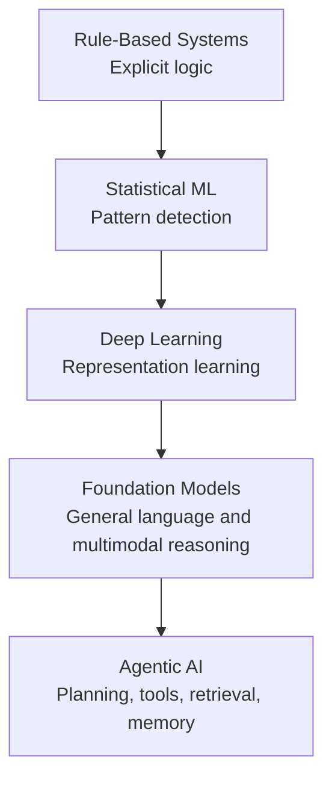
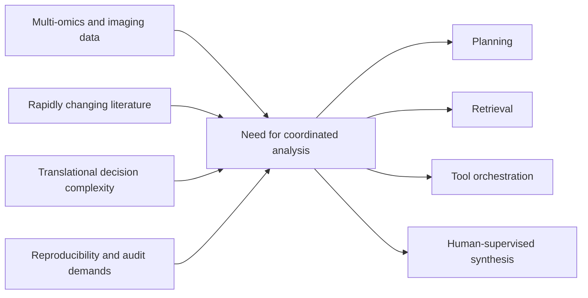
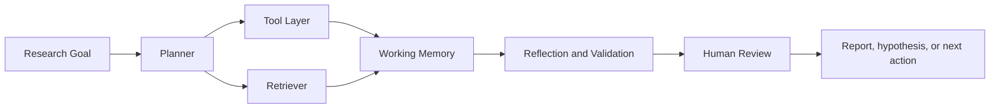

# Chapter 01: Introduction to Agentic AI in Cancer Research

## Learning Objectives

By the end of this chapter, you will be able to:

- Define agentic AI and distinguish it from conventional machine learning and workflow automation.
- Explain why oncology is a strong application domain for agents that can plan, retrieve evidence, and orchestrate tools.
- Identify the core components of an AI agent: planning, memory, retrieval, tool use, reflection, and human oversight.
- Compare traditional biomedical pipelines with adaptive agentic systems.
- Recognize common biomedical use cases, limitations, and governance requirements for deploying agentic systems safely.

---

## Introduction

Cancer research is now shaped by an unusual combination of scale and fragmentation. Sequencing assays generate high-dimensional molecular data, pathology platforms produce image-rich phenotypes, and the oncology literature expands faster than any individual team can review manually. At the same time, translational decisions often depend on stitching together heterogeneous evidence: genomic context, disease biology, therapeutic mechanisms, trial eligibility, and clinical feasibility.

Traditional computational systems help with individual tasks such as classification, ranking, or workflow execution, but they usually stop short of coordinating an end-to-end research objective. Agentic AI extends modern foundation models with the ability to decompose goals, retrieve evidence, invoke tools, maintain state across steps, and revise intermediate outputs. In cancer research, that combination matters because many real tasks are not single predictions. They are multi-step investigations that require evidence gathering, iterative analysis, and explicit reasoning over uncertainty.

This chapter introduces agentic AI as a practical computational paradigm for oncology. The emphasis is not on hype or autonomy for its own sake. The central question is when an AI system should behave like a research assistant that can help structure and accelerate work while remaining grounded in evidence and subject to expert review.

---

## 1.1 The Evolution of AI Systems

Agentic AI did not appear in isolation. It emerged from a sequence of increasingly capable computational paradigms.

### Rule-Based Systems

Early biomedical decision support systems relied on expert-authored logic. These systems were interpretable and easy to audit in narrow domains.

```text
IF mutation = EGFR
AND exon = 19 deletion
THEN suggest EGFR inhibitor evaluation
```

Rule-based systems were useful when domain knowledge was stable and the number of conditions was limited. Their weaknesses became obvious in cancer research, where biological context is probabilistic, evidence changes quickly, and interactions among mutations, cell states, and treatments are rarely captured by small sets of deterministic rules.

### Statistical Machine Learning

Statistical learning methods introduced data-driven modeling and uncertainty-aware prediction. In biomedical settings, logistic regression, support vector machines, random forests, and Bayesian models improved tasks such as prognosis estimation, subtype classification, and biomarker prioritization. These systems were more flexible than rules, but still depended heavily on manually engineered features and carefully bounded prediction targets.

### Deep Learning

Deep learning shifted the field toward representation learning, making it possible to model complex biological signals directly from images, sequences, and other high-dimensional inputs. This enabled progress in histopathology, radiology, genomics, and protein structure modeling. Deep learning systems reduced dependence on handcrafted features, but most remained task-specific: they predicted labels well while offering limited support for planning, tool execution, or grounded scientific synthesis.

### Foundation Models

Transformer-based foundation models expanded what AI systems could do with language, code, and multimodal inputs. Biomedical adaptations such as PubMedBERT and BioGPT demonstrated that large pretraining corpora could support terminology-sensitive reasoning and scientific text generation [1, 2]. More recent medical foundation models further showed promise in question answering, summarization, and clinical-style reasoning, though real-world reliability remains constrained by grounding and evaluation challenges [3].

### Agentic AI

Agentic systems build on foundation models by coupling them with external capabilities:

- goal interpretation
- task decomposition
- evidence retrieval
- tool invocation
- intermediate memory
- self-checking or reflection
- iterative interaction with users and environments

The result is a shift from isolated inference toward coordinated problem solving. For oncology, that means the system can support research workflows such as retrieving literature, prioritizing candidate targets, organizing analysis steps, and producing evidence-aware summaries rather than only returning a single prediction.

### Graphical Summary: From Predictors to Research Collaborators



---

## 1.2 Defining Agentic AI

Agentic AI refers to systems that pursue user-defined objectives through multiple coordinated actions rather than a single inference step. The system may be fully autonomous for bounded tasks or semi-autonomous within a human-supervised workflow. The key property is not agency in a philosophical sense; it is operational competence in carrying out a sequence of actions under constraints.

In practice, an agentic biomedical system can:

- interpret a research goal
- plan a sequence of sub-tasks
- retrieve literature or structured evidence
- call analytical tools or APIs
- track intermediate results
- evaluate whether the current answer is sufficient
- revise its plan when evidence or tool outputs change

This differs from a conventional prediction model. A classifier may estimate whether a tumor sample belongs to a subtype. An agentic system, by contrast, could gather relevant assays, inspect metadata quality, identify the required analysis pipeline, retrieve literature on subtype markers, summarize confidence limits, and prepare a draft report for expert review.

The practical implication is that agentic AI sits at the intersection of reasoning, orchestration, and evidence management. It is best understood as a systems pattern rather than a single model architecture.

---

## 1.3 Why Cancer Research Needs Agentic AI

Cancer research is especially well matched to agentic systems because the work itself is multi-stage, evidence-heavy, and highly interdisciplinary.

### Data Volume and Modality Diversity

Modern oncology programs routinely combine whole-genome or exome sequencing, RNA-seq, single-cell data, spatial assays, pathology images, proteomics, and clinical covariates. Large consortia such as TCGA helped establish the scale and diversity of these integrated datasets [4]. The bottleneck is rarely raw data availability alone. It is the effort required to coordinate analysis decisions across modalities.

### Literature Growth

The oncology literature evolves continuously, with new studies, biomarkers, trial results, and resistance mechanisms appearing faster than manual review processes can absorb them. Static models trained once on historical data cannot keep pace with this rate of change. Agents paired with retrieval systems are better positioned to incorporate recent evidence and expose the sources behind their conclusions.

### Translational Complexity

Cancer biology is not reducible to a single abstraction level. Translational decisions may require alignment across molecular pathways, tumor context, assay quality, drug mechanisms, and clinical eligibility criteria. These dependencies create workflows that are difficult to encode as rigid, fixed pipelines.

### Reproducibility Pressure

Biomedical research increasingly expects analyses to be traceable, reproducible, and FAIR [5]. Yet many practical workflows still involve ad hoc notebooks, manual file handling, fragmented toolchains, and incomplete provenance. Agentic systems can help by explicitly recording plans, tool calls, assumptions, and evidence sources.

### Where Agents Help Most

Agentic AI is most useful when the work requires:

- multiple dependent steps
- coordination across tools or databases
- rapid literature grounding
- iterative refinement under uncertainty
- transparent handoff to a human expert

### Graphical Summary: Why Oncology Creates Design Pressure for Agents



---

## 1.4 Core Components of AI Agents

Although implementations vary, robust biomedical agents usually rely on a common set of architectural components.

### Planning

Planning converts a broad goal into executable sub-tasks. In research settings, this often means decomposing a question into data access, preprocessing, analysis, validation, and reporting steps.

```text
Goal:
Identify candidate therapeutic targets in melanoma.

Plan:
1. Retrieve expression and mutation datasets.
2. Run differential expression analysis.
3. Compare pathway enrichment results.
4. Retrieve literature on top candidates.
5. Rank targets with supporting evidence.
6. Generate a review-ready summary.
```

Planning does not need to be perfectly autonomous to be valuable. Even partial plan generation can reduce coordination overhead for research teams.

### Memory

Memory allows an agent to preserve context over time.

| Memory Type | Role in Biomedical Workflows | Example |
|---|---|---|
| Short-term memory | Track the active task state | Current analysis request and latest tool outputs |
| Long-term memory | Reuse prior knowledge | Past variant interpretation decisions |
| Vector memory | Retrieve semantically similar content | Similar abstracts or protocol notes |
| Structured memory | Store factual relations with constraints | Gene-disease-drug links in a graph or database |

### Tool Use

Agents become materially more useful when they can interact with external systems rather than only produce text.

| Tool or Resource | Typical Role |
|---|---|
| PubMed or Europe PMC APIs | Retrieve literature and abstracts |
| BLAST or alignment tools | Sequence comparison |
| GATK or variant tools | Variant processing |
| Scanpy | Single-cell analysis |
| Neo4j or graph databases | Relationship querying |
| ClinicalTrials.gov | Trial discovery and matching |

### Retrieval

Retrieval supplies current evidence and reduces dependence on model-internal memory. In biomedicine, retrieval is essential because claims should be attributable to sources, and those sources change over time. Retrieval-augmented generation has become a common strategy for grounding model responses in external documents [6].

### Reflection

Reflection is the ability to inspect an intermediate result, identify gaps or errors, and revise the next step. Reflection is useful in biomedical contexts because uncertainty is common and source quality varies. A well-designed agent can flag low-confidence evidence, request more context, or rerun a step with different constraints instead of presenting the first answer as final.

### Human Oversight

Biomedical agents should be designed around supervised delegation, not unsupervised authority. The human expert remains responsible for deciding whether evidence is sufficient, whether a recommendation is safe, and whether the output is appropriate for downstream scientific or clinical use.

### Graphical Summary: Agent Architecture for Oncology Workflows



---

## 1.5 Agentic Systems vs Traditional Pipelines

Traditional pipelines remain essential in cancer research. They provide stability, validation, and reproducibility for well-defined workflows. Agentic systems should therefore be understood as complementary rather than universally superior.

| Feature | Traditional Pipeline | Agentic System |
|---|---|---|
| Workflow structure | Fixed and pre-authored | Dynamic and adaptive |
| Planning | Minimal | Explicit task decomposition |
| Tool orchestration | Usually limited to predefined steps | Flexible across tools and sources |
| Evidence retrieval | Often manual or precomputed | On-demand and source-aware |
| Error handling | Hard-coded or brittle | Can re-plan or ask for clarification |
| Collaboration style | Pipeline operator executes | Human and agent co-work |

Traditional pipelines are preferable when the protocol is already stable, heavily validated, and subject to regulatory or quality control constraints. Agentic systems become more valuable when the problem is exploratory, cross-source, or under-specified.

---

## 1.6 Representative Biomedical Use Cases

### Literature Mining

Agents can retrieve, cluster, and summarize evidence on biomarkers, drug resistance, or emerging therapeutic strategies. The important design requirement is that summaries remain source-linked and uncertainty-aware rather than being presented as unsupported prose.

### Variant Interpretation

A useful agent can aggregate evidence from variant databases, gene-specific context, and the current literature to prepare a draft interpretation. The human reviewer should still verify pathogenicity claims and downstream actionability.

### Single-Cell and Spatial Analysis

Single-cell and spatial workflows often involve repetitive but decision-heavy steps such as quality control, clustering parameter selection, cell-state annotation, and enrichment analysis. Agents can help orchestrate these steps, maintain provenance, and document analytical choices.

### Clinical Trial Matching

Trial matching requires parsing genomic findings, tumor type, prior therapy history, and eligibility criteria. Agents are well suited to preprocessing and ranking tasks, but clinical review remains mandatory before any operational use.

### Knowledge-Grounded Scientific Reporting

An agent can turn intermediate analyses into structured summaries with citations, flagged assumptions, and recommended next steps. This is one of the most immediately useful forms of agentic support because it saves time without requiring high-risk autonomy.

### Applied Example: Biomarker Prioritization Workflow

Consider a translational oncology team asking a seemingly simple question: which biomarkers are most strongly associated with resistance to a therapy in a specific tumor context? In practice, that request spans cohort definition, assay selection, statistical comparison, literature review, pathway interpretation, and report generation. An agentic system is useful here not because it replaces scientific judgment, but because it can preserve structure across the many small decisions that otherwise become scattered across notebooks, spreadsheets, and browser tabs.

An evidence-grounded biomarker workflow might look like this:

1. define the cohort and therapeutic context
2. verify the data modalities and minimum quality checks required
3. run or recommend the appropriate statistical comparisons
4. retrieve supporting and conflicting literature for top candidates
5. rank candidates with explicit rationale and confidence notes
6. prepare a summary for expert review

The output should still be treated as a draft scientific artifact. The value lies in making the reasoning chain inspectable: which data were used, which papers were retrieved, where contradictory evidence appeared, and which assumptions were made before ranking candidates.

---

## 1.7 Limitations, Risks, and Governance

The strongest case for agentic AI in oncology is also the reason caution is necessary: these systems can influence high-impact research and clinical-adjacent decisions.

### Hallucinations and Unsupported Claims

Large language models can produce plausible but incorrect biomedical statements. Retrieval improves grounding but does not eliminate misinterpretation, especially when evidence is contradictory or low quality.

### Evidence Reliability

Not all retrieved sources are equally trustworthy. Preprints, outdated guidelines, or irreproducible findings may enter the reasoning chain unless sources are filtered and ranked carefully.

### Clinical Safety

Any workflow that may influence patient care requires strict boundaries. Agentic systems can assist with literature review, evidence organization, and draft generation, but they should not be treated as autonomous clinical decision makers.

### Computational and Operational Cost

Multi-step agentic workflows may require repeated model calls, external tools, storage layers, and audit infrastructure. The engineering burden is often higher than teams expect when they move from demonstrations to dependable systems.

### Governance and Compliance

Biomedical systems may need audit trails, access controls, validation procedures, and organizational governance. In regulated contexts, the design target should be traceable augmentation with human accountability.

These requirements are not only institutional constraints. They are also design inputs. A system that cannot expose its sources, tool traces, and review points is difficult to validate and therefore difficult to trust. This is one reason lightweight, evidence-grounded assistants often create value sooner than more autonomous systems [7].

---

## 1.8 Human-in-the-Loop Design Principles

The default design stance for cancer research should be AI-assisted, human-supervised work. Human-in-the-loop design is not a concession. It is the mechanism that keeps agentic systems scientifically useful and operationally safe.

Practical principles include:

- require citation-backed outputs for factual claims
- expose tool traces and intermediate reasoning summaries where appropriate
- allow users to approve or reject major workflow transitions
- preserve provenance for datasets, prompts, and external queries
- separate exploratory assistance from clinical recommendation pathways
- evaluate outputs against domain-specific benchmarks, not generic fluency

The most effective early deployments are likely to be systems that reduce researcher workload while making uncertainty visible. Examples include literature triage assistants, workflow planners, evidence-grounded reporting tools, and notebook copilots for exploratory analysis.

---

## Key Takeaways

- Agentic AI extends foundation models with planning, retrieval, memory, tool use, and reflection.
- Cancer research is a strong application domain because many workflows are multi-step, evidence-intensive, and multidisciplinary.
- Agentic systems complement rather than replace validated biomedical pipelines.
- Human oversight, citation grounding, and governance controls are core design requirements, not optional extras.
- Near-term value is highest in research assistance, workflow orchestration, and evidence-grounded summarization.

---

## References

1. Gu Y, Tinn R, Cheng H, et al. Domain-specific language model pretraining for biomedical natural language processing. ACM Transactions on Computing for Healthcare. 2021;3(1):1-23.
2. Luo R, Sun L, Xia Y, et al. BioGPT: generative pre-trained transformer for biomedical text generation and mining. Briefings in Bioinformatics. 2022;23(6):bbac409.
3. Singhal K, Tu T, Gottweis J, et al. Towards expert-level medical question answering with large language models. Nature. 2025;635:582-588.
4. Weinstein JN, Collisson EA, Mills GB, et al. The Cancer Genome Atlas Pan-Cancer analysis project. Nature Genetics. 2013;45(10):1113-1120.
5. Wilkinson MD, Dumontier M, Aalbersberg IJ, et al. The FAIR guiding principles for scientific data management and stewardship. Scientific Data. 2016;3:160018.
6. Lewis P, Perez E, Piktus A, et al. Retrieval-augmented generation for knowledge-intensive NLP tasks. Advances in Neural Information Processing Systems. 2020;33:9459-9474.
7. Wang L, Ma C, Feng S, et al. A survey on large language model based autonomous agents. Frontiers of Computer Science. 2024;18:186345.

---

## Further Reading

- Sutton RS, Barto AG. Reinforcement Learning: An Introduction. 2nd ed. MIT Press; 2018.
- Russell SJ, Norvig P. Artificial Intelligence: A Modern Approach. 4th ed. Pearson; 2021.
- National Academies of Sciences, Engineering, and Medicine. Developing Artificial Intelligence in Oncology: Opportunities, Challenges, and Governance Considerations. Washington, DC: National Academies Press.

